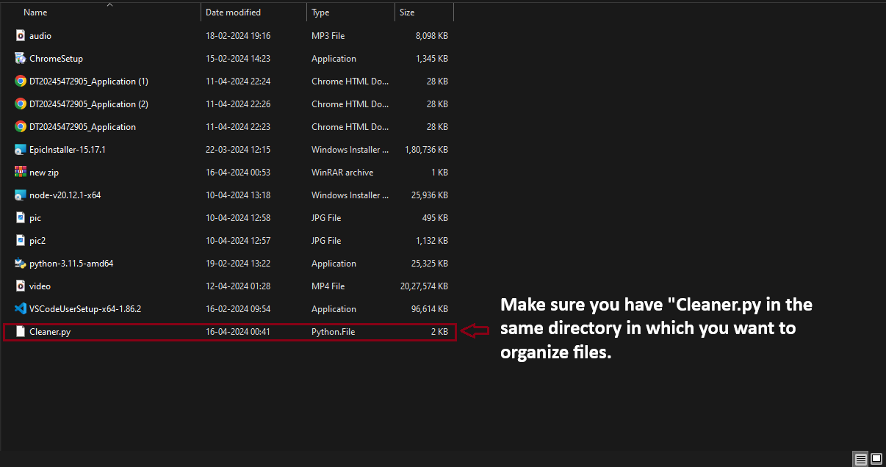

# Folder Cleaner/Organizer🚀

## Overview

- This Python script is a simple file organizer designed to automatically categorize files in a directory based on their file extensions. It helps you keep your files organized by moving them into specific folders such as Images, Media, Docs, Softwares, Zips, and Others.

## Features

- Automatic Categorization: The script automatically identifies and sorts files into their respective folders based on predefined file extensions.
- Extensible: You can easily customize the file extensions and folder names by updating the extensions_mapping dictionary in the script.
- Error Handling: The script includes error handling to manage exceptions that might occur during file operations or directory access.

## Usage

1. Clone the repository or download the Cleaner.py file.
2. Move the Cleaner.py file to the directory you want to organize files.
   
3. Open command prompt in the directory you want to organize and run the python script.
   `python Cleaner.py`
   
4. Files will be automatically sorted into their respective folders.

## Customization

- You can customize the script by updating the extensions dictionary to add or remove file extensions and their corresponding folders.

## Note

- Ignore any error, the script will run with ease without any problem
