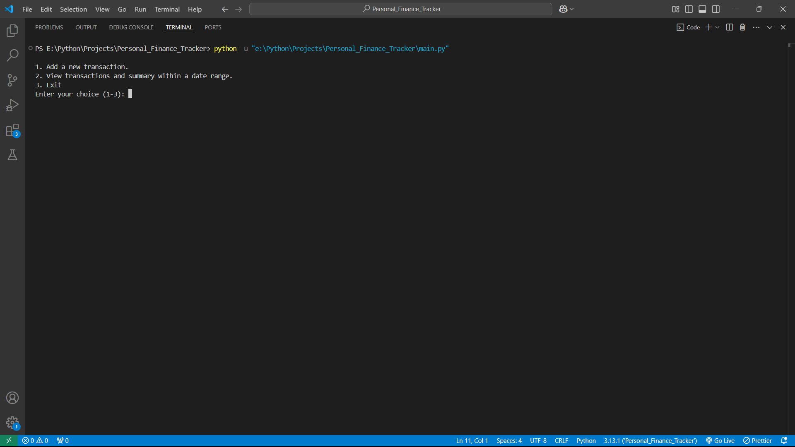
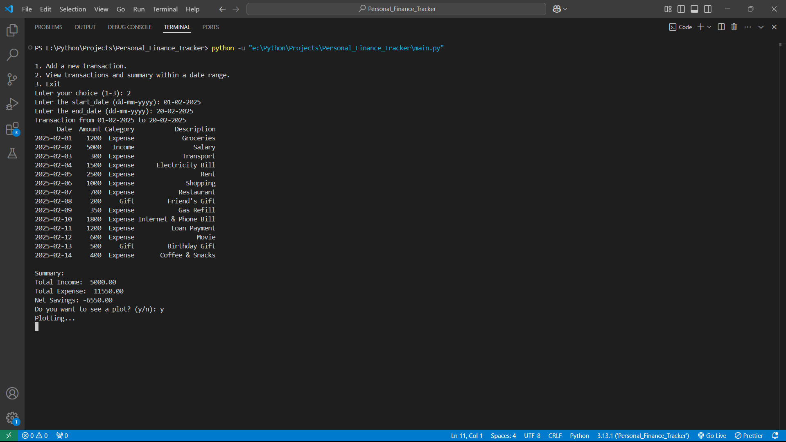
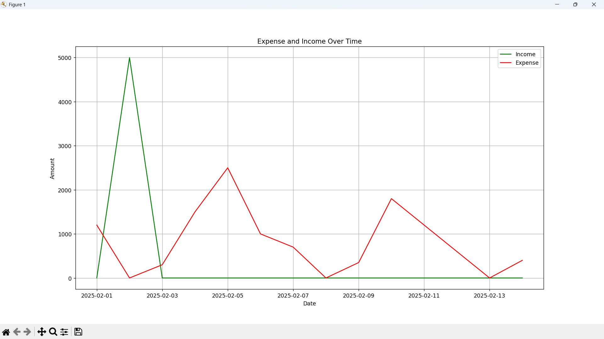

# Personal Finance Tracker

💰 A **CLI-based Personal Finance Tracker** built in Python, utilizing **classes, pandas, matplotlib, and datetime module**. This tool allows users to efficiently manage their finances by adding transactions, viewing summaries, and generating graphical insights.

## ✨ Features

- ✅ **Add a transaction** (Date, Amount, Category, Description)
- ✅ **View transactions & summary** within a specified date range
- ✅ **Calculate total income, total expense, and net savings**
- ✅ **Plot a line graph** of financial trends using `matplotlib`
- ✅ **Automatically stores transactions in a CSV file**

## ⚙️ Installation

### Prerequisites

Ensure you have the following installed:

- Python 3.x
- pip (Python package manager)

### Additional Python Libraries

- Pandas
- Matplot
  
### Steps to Install and Run

1. Clone the repository:
   ```sh
   git clone https://github.com/Saurabhhhhhh/Python-Projects
   cd Python-Projects
   git sparse-checkout set Personal_Finance_Tracker
   cd Personal_Finance_Tracker
   ```
2. Install required dependencies:
   ```sh
   pip install -r requirements.txt
   ```
3. Run the application:
   ```sh
   python main.py
   ```

## 🖥️ Usage

Once you run `main.py`, the following menu appears:

```sh
1. Add a new transaction.
2. View transactions and summary within a date range.
3. Exit
Enter your choice (1-3):
```

### 1️⃣ Adding a New Transaction

- The user is prompted to enter the **date** (`dd-mm-yyyy` format). Pressing **Enter** automatically fills in today's date.
- Then, the user inputs the **amount**, selects a **category** (`Income` or `Expense`), and optionally enters a **description**.
- The transaction is saved to a CSV file.

### 2️⃣ Viewing Transactions & Summary

- Users enter a **start date** and **end date** (`dd-mm-yyyy`).
- The program displays all transactions within that range, formatted like:

```sh
Transactions from 01-02-2025 to 10-02-2025:
      Date  Amount Category           Description
2025-02-01    1200  Expense             Groceries
2025-02-02    5000   Income                Salary
2025-02-03     300  Expense             Transport
...

Summary:
Total Income:  5000.00
Total Expense:  9350.00
Net Savings: -4350.00
```

- The user is then asked:
  ```sh
  Do you want to see a plot? (y/n):
  ```
- If they choose **'y'**, a **line graph is displayed** showing the financial trend.
- After closing the graph, the **main menu appears again**.
- The program exits **only when the user selects option (3)**.

### 3️⃣ Exiting the Program

- Selecting **option (3)** cleanly exits the program.

## Screenshots

📌 **Main Menu Screenshot:**  

📌 **Sample Transactions Output:**  

📌 **Financial Graph Output:**  


## 🚀 Future Enhancements

- 🔍 **Filtering transactions by category**
- 📊 **Adding different types of visualizations (Pie charts, bar graphs)**
- 📁 **Exporting data to JSON or Excel format**
- 📅 **Adding more categories**

## Contributions

Contributions are welcome! Feel free to fork this repository and submit a pull request.

---
